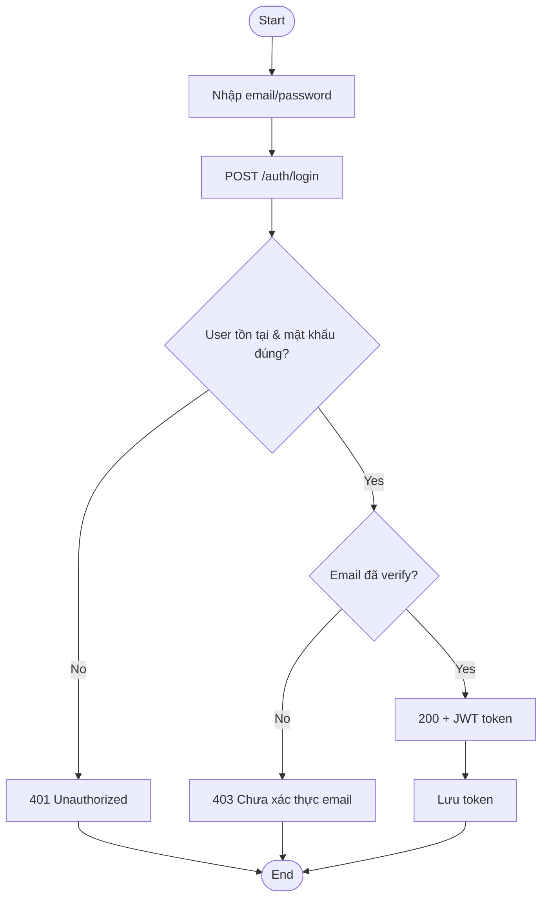
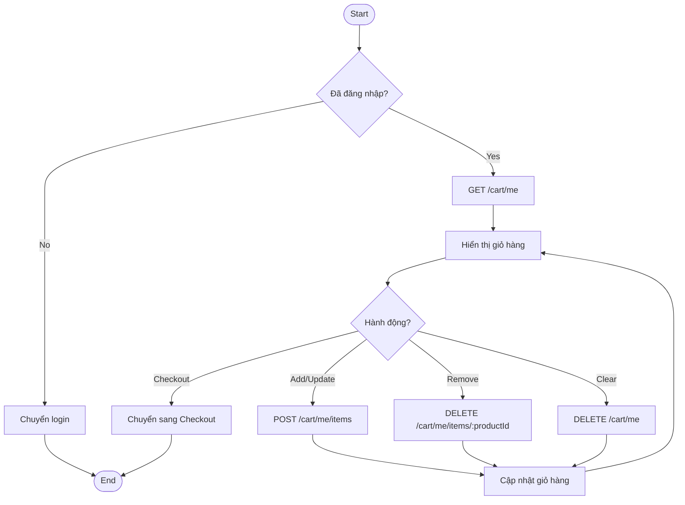
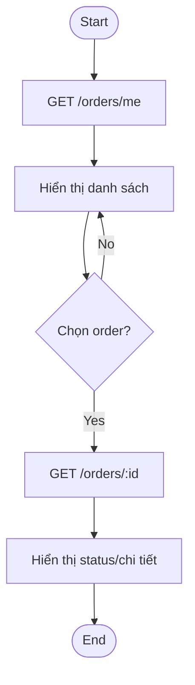
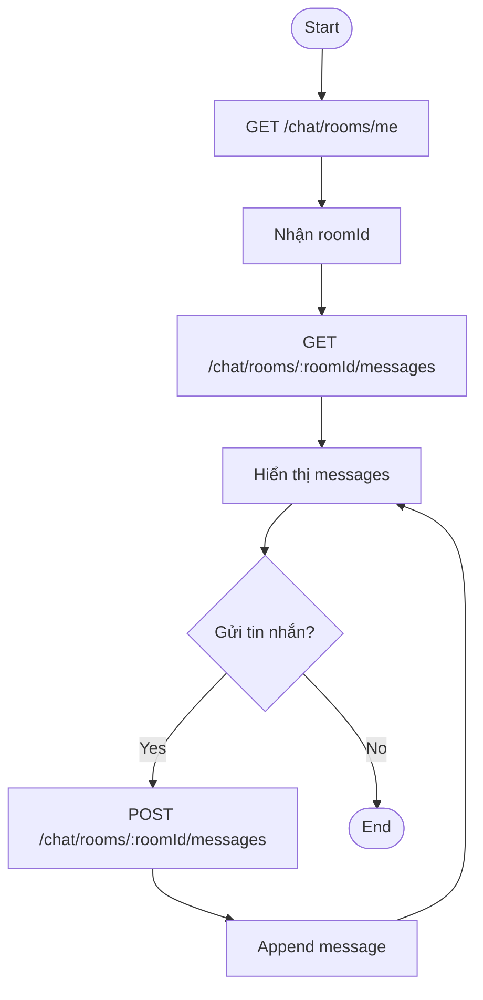
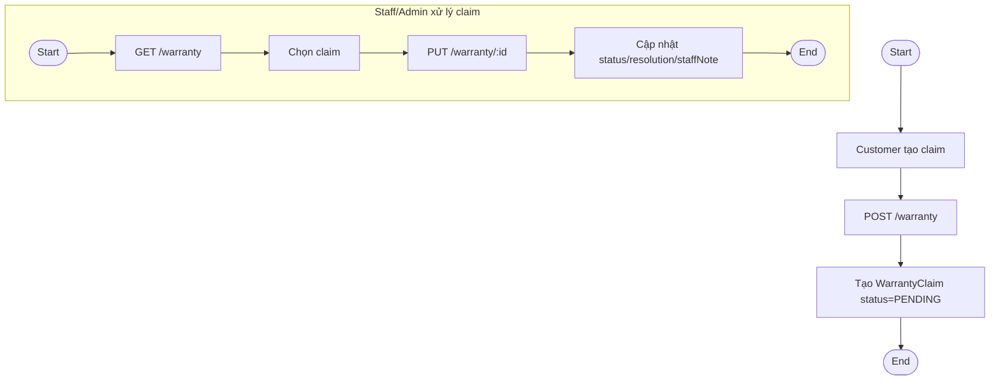

# Activity Diagrams — TechGearVN (theo luồng nghiệp vụ/API hiện tại)

Mermaid hiện không có “UML activity diagram” chuẩn, nên phần này dùng **flowchart** để biểu diễn activity (decision/branch/loop).

---

## 1) Activity: Register (OTP)

```mermaid
flowchart TD
  A([Start]) --> B[Nhập thông tin đăng ký]
  B --> C[POST /auth/register]
  C --> D{Email đã tồn tại?}
  D -- Yes --> E[Thông báo lỗi 400] --> Z([End])
  D -- No --> F[Tạo/Update PendingRegistration + OTP expire]
  F --> G[Gửi OTP email]
  G --> H[User nhập OTP]
  H --> I[POST /auth/register/confirm]
  I --> J{OTP hợp lệ & chưa hết hạn?}
  J -- No --> K[Thông báo lỗi 400] --> H
  J -- Yes --> L[Tạo User (CUSTOMER,isVerified=true)]
  L --> M[Xoá PendingRegistration]
  M --> N[Trả JWT token]
  N --> Z([End])
```

---

## 2) Activity: Login



---

## 3) Activity: Browse/Search + View Product Detail

```mermaid
flowchart TD
  A([Start]) --> B[Mở trang sản phẩm]
  B --> C[GET /products (filter/search/sort)]
  C --> D[Hiển thị danh sách]
  D --> E{Chọn 1 sản phẩm?}
  E -- No --> D
  E -- Yes --> F[GET /products/:id]
  F --> G[Hiển thị chi tiết]
  G --> H{Cần xem specs?}
  H -- Yes --> I[GET /products/:id/specs]
  I --> G
  H -- No --> Z([End])
```

---

## 4) Activity: Manage Cart



---

## 5) Activity: Checkout (COD)

```mermaid
flowchart TD
  A([Start]) --> B[Nhập thông tin nhận hàng]
  B --> C{Có voucher?}
  C -- Yes --> D[GET /vouchers/validate]
  D --> E{Voucher hợp lệ?}
  E -- No --> F[Báo lỗi/nhập lại code] --> C
  E -- Yes --> G[Áp dụng giảm giá]
  C -- No --> H[Tiếp tục]

  G --> H
  H --> I[Chọn paymentMethod=COD]
  I --> J[POST /orders]
  J --> K[Tạo Order (UNPAID/PAID tuỳ logic, COD thường UNPAID)]
  K --> L{Có clear cart?}
  L -- Yes --> M[Clear cart items]
  L -- No --> N[Giữ cart]
  M --> O[Hiển thị Order success]
  N --> O
  O --> Z([End])
```

---

## 6) Activity: Checkout (Online payment - PayOS/VNPay/MoMo)

```mermaid
flowchart TD
  A([Start]) --> B[POST /orders (paymentStatus=UNPAID)]
  B --> C[Nhận orderId]
  C --> D[POST /payments/<provider>/create/:orderId]
  D --> E[Nhận paymentUrl]
  E --> F[Redirect user sang cổng thanh toán]

  F --> G{Kết quả thanh toán}
  G -- Success --> H[Provider gọi webhook/return]
  H --> I[BE update Order.paymentStatus=PAID]
  I --> J[FE load lại order]
  J --> Z([End])

  G -- Cancel/Fail --> K[Return/cancel]
  K --> L[Order vẫn UNPAID]
  L --> Z
```

---

## 7) Activity: View/Track Orders



---

## 8) Activity: Rate & Review + Moderation

```mermaid
flowchart TD
  A([Start]) --> B[Customer tạo review]
  B --> C[POST /reviews]
  C --> D{Trùng review (user+product+order)?}
  D -- Yes --> E[409 Already reviewed] --> Z([End])
  D -- No --> F[Tạo review status=PENDING]
  F --> G([End])

  subgraph MOD[Moderation (Staff/Admin)]
    M1([Start]) --> M2[GET /reviews/pending]
    M2 --> M3[Chọn review]
    M3 --> M4[PUT /reviews/:id/moderate]
    M4 --> M5[Status=APPROVED/HIDDEN]
    M5 --> M6([End])
  end
```

---

## 9) Activity: Chat Support



---

## 10) Activity: Staff/Admin/Delivery cập nhật trạng thái đơn

```mermaid
flowchart TD
  A([Start]) --> B[GET /orders (role=ADMIN/STAFF/DELIVERY)]
  B --> C[Chọn order]
  C --> D[PUT /orders/:id/status]
  D --> E{Status hợp lệ?}
  E -- No --> F[400/422] --> C
  E -- Yes --> G[Cập nhật orderStatus]
  G --> Z([End])
```

---

## 11) Activity: Warranty Claim



---

## 12) Activity: Import Receipt (Nhập hàng)

```mermaid
flowchart TD
  A([Start]) --> B{Supplier đã có?}
  B -- No --> C[POST /suppliers]
  C --> D[Supplier created]
  B -- Yes --> E[Chọn supplier]

  D --> E
  E --> F[Nhập details (product, quantity, importPrice)]
  F --> G[POST /import-receipts]
  G --> H[Tạo ImportReceipt]
  H --> I[GET /import-receipts]
  I --> Z([End])
```
