# Class Diagram (UML) — TechGearVN (theo code BE hiện tại)

Class diagram này mô tả các lớp nghiệp vụ chính theo `BE/server/models/*` (MongoDB/Mongoose).

> Ghi chú:
>
> - Các quan hệ `*--` biểu thị **embedded subdocument** (composition).
> - Các quan hệ `-->` biểu thị **tham chiếu ObjectId (`ref`)**.

```mermaid
classDiagram
  direction LR

  class User {
    +ObjectId _id
    +string fullName
    +string email
    +string password
    +string authProvider
    +string googleId
    +string avatarUrl
    +string phone
    +string address
    +string provinceCity
    +UserAddress[] addresses
    +Role role
    +bool isBlocked
    +bool isVerified
    +Date createdAt
    +Date updatedAt

    +updateProfile(patch)
    +addAddress(address)
    +setDefaultAddress(index)
    +setRole(role)
    +setBlocked(isBlocked)
    +markEmailVerified()
  }

  class UserAddress {
    +string label
    +string fullName
    +string phoneNumber
    +string addressLine
    +bool isDefault
  }

  class PendingRegistration {
    +ObjectId _id
    +string fullName
    +string email
    +string passwordHash
    +string phone
    +string address
    +string codeHash
    +Date codeExpire
    +number resendCount
    +Date lastSentAt
    +Date createdAt
    +Date updatedAt
  }

  class Category {
    +ObjectId _id
    +string name
    +string slug
    +ObjectId parent
    +Date createdAt
    +Date updatedAt

    +setParent(parentId)
    +rename(name,slug)
  }

  class Brand {
    +ObjectId _id
    +string name
    +string slug
    +Date createdAt
    +Date updatedAt

    +rename(name,slug)
  }

  class Product {
    +ObjectId _id
    +string name
    +string slug
    +string sku
    +number price
    +number originalPrice
    +number stockQuantity
    +ObjectId category
    +ObjectId brand
    +string thumbnail
    +string description
    +ProductStatus status
    +Date createdAt
    +Date updatedAt

    +updateInfo(patch)
    +setStatus(status)
    +adjustStock(delta)
  }

  class ProductSpec {
    +ObjectId _id
    +ObjectId product
    +string specKey
    +string specValue
    +Date createdAt
    +Date updatedAt

    +setValue(value)
  }

  class Cart {
    +ObjectId _id
    +ObjectId user
    +CartItem[] items
    +Date createdAt
    +Date updatedAt

    +upsertItem(productId,quantity)
    +removeItem(productId)
    +replace(items[])
    +clear()
  }

  class CartItem {
    +ObjectId product
    +number quantity
    +string productName
    +number price
    +string thumbnail
  }

  class Order {
    +ObjectId _id
    +ObjectId user
    +string fullName
    +string phoneNumber
    +string shippingAddress
    +PaymentMethod paymentMethod
    +PaymentStatus paymentStatus
    +OrderStatus orderStatus
    +number totalAmount
    +number shippingFee
    +number finalAmount
    +string voucherCode
    +number discountAmount
    +OrderItem[] items
    +number payosOrderCode
    +string payosPaymentLinkId
    +Date createdAt
    +Date updatedAt

    +addItem(productId,productName,quantity,price)
    +setShipping(fullName,phoneNumber,shippingAddress)
    +applyVoucher(code,discountAmount)
    +setPaymentMethod(method)
    +markPaid()
    +updateStatus(orderStatus)
  }

  class OrderItem {
    +ObjectId product
    +string productName
    +number quantity
    +number price
  }

  class Review {
    +ObjectId _id
    +ObjectId user
    +ObjectId product
    +ObjectId order
    +number rating
    +string comment
    +string[] images
    +ReviewStatus status
    +string reply
    +Date createdAt
    +Date updatedAt

    +submit(rating,comment,images[])
    +moderate(status,reply)
  }

  class Voucher {
    +ObjectId _id
    +string code
    +DiscountType discountType
    +number discountValue
    +number minOrderValue
    +number maxDiscountAmount
    +Date startDate
    +Date endDate
    +number usageLimit
    +number usedCount
    +VoucherStatus status
    +Date createdAt
    +Date updatedAt

    +validate(orderValue,now)
    +claimUsage()
    +rollbackUsage()
    +setStatus(status)
  }

  class Supplier {
    +ObjectId _id
    +string name
    +string contactPerson
    +string phone
    +string email
    +string address
    +Date createdAt
    +Date updatedAt

    +updateInfo(patch)
  }

  class ImportReceipt {
    +ObjectId _id
    +ObjectId supplier
    +ObjectId staff
    +number totalCost
    +string note
    +ImportReceiptDetail[] details
    +Date createdAt
    +Date updatedAt

    +addDetail(productId,quantity,importPrice)
    +recalculateTotalCost()
  }

  class ImportReceiptDetail {
    +ObjectId product
    +number quantity
    +number importPrice
  }

  class WarrantyClaim {
    +ObjectId _id
    +ObjectId user
    +string orderItemId
    +string productSerialNumber
    +string reason
    +string[] imageProof
    +WarrantyStatus status
    +WarrantyResolution resolution
    +string staffNote
    +Date createdAt
    +Date updatedAt

    +submit(orderItemId,reason,proof[])
    +updateStatus(status,resolution,staffNote)
  }

  class ChatRoom {
    +ObjectId _id
    +ObjectId user
    +ChatRoomStatus status
    +Date createdAt
    +Date updatedAt

    +close()
    +reopen()
  }

  class ChatMessage {
    +ObjectId _id
    +ObjectId room
    +ObjectId sender
    +string message
    +bool isRead
    +Date createdAt
    +Date updatedAt

    +markRead()
  }

  class Article {
    +ObjectId _id
    +string title
    +string slug
    +string thumbnail
    +string content
    +ObjectId author
    +ArticleType type
    +bool isActive
    +Date createdAt
    +Date updatedAt

    +publish()
    +unpublish()
    +updateContent(patch)
  }

  class Banner {
    +ObjectId _id
    +string imageUrl
    +string title
    +string linkUrl
    +number displayOrder
    +string position
    +bool isActive
    +Date createdAt
    +Date updatedAt

    +activate()
    +deactivate()
    +updateInfo(patch)
  }

  class Setting {
    +ObjectId _id
    +string key
    +number shippingFee
    +Footer footer
    +Date createdAt
    +Date updatedAt

    +update(patch)
  }

  class Footer {
    +string aboutText
    +string[] addresses
    +string hotline
    +string email
    +string companyLine1
    +string companyLine2
  }

  class SavedPcBuild {
    +ObjectId _id
    +ObjectId user
    +string name
    +number totalPrice
    +string shareLink
    +SavedPcBuildItem[] items
    +Date createdAt
    +Date updatedAt

    +addItem(productId)
    +removeItem(productId)
    +computeTotal()
    +rename(name)
  }

  class SavedPcBuildItem {
    +ObjectId product
    +string productName
    +number price
    +string category
  }

  %% Enums (logical)
  class Role {
    <<enumeration>>
    CUSTOMER
    STAFF
    ADMIN
    DELIVERY
  }

  class PaymentMethod {
    <<enumeration>>
    COD
    VNPAY
    MOMO
    PAYOS
  }

  class PaymentStatus {
    <<enumeration>>
    UNPAID
    PAID
  }

  class OrderStatus {
    <<enumeration>>
    PENDING
    PROCESSING
    SHIPPING
    COMPLETED
    CANCELLED
    RETURNED
  }

  class ProductStatus {
    <<enumeration>>
    ACTIVE
    INACTIVE
  }

  class ReviewStatus {
    <<enumeration>>
    PENDING
    APPROVED
    HIDDEN
  }

  class DiscountType {
    <<enumeration>>
    PERCENT
    FIXED_AMOUNT
  }

  class VoucherStatus {
    <<enumeration>>
    ACTIVE
    INACTIVE
  }

  class WarrantyStatus {
    <<enumeration>>
    PENDING
    RECEIVED_PRODUCT
    PROCESSING
    COMPLETED
    REJECTED
  }

  class WarrantyResolution {
    <<enumeration>>
    REPAIR
    REPLACE
    REFUND
  }

  class ChatRoomStatus {
    <<enumeration>>
    OPEN
    CLOSED
  }

  class ArticleType {
    <<enumeration>>
    NEWS
    BUILD_GUIDE
    REVIEW
  }

  %% Relationships
  User *-- UserAddress : addresses[]

  Category --> Category : parent (ref)

  Product --> Category : category (ref)
  Product --> Brand : brand (ref)

  ProductSpec --> Product : product (ref)

  Cart --> User : user (ref)
  Cart *-- CartItem : items[]
  CartItem --> Product : product (ref)

  Order --> User : user (ref)
  Order *-- OrderItem : items[]
  OrderItem --> Product : product (ref)

  Review --> User : user (ref)
  Review --> Product : product (ref)
  Review --> Order : order (ref)

  ImportReceipt --> Supplier : supplier (ref)
  ImportReceipt --> User : staff (ref)
  ImportReceipt *-- ImportReceiptDetail : details[]
  ImportReceiptDetail --> Product : product (ref)

  WarrantyClaim --> User : user (ref)

  ChatRoom --> User : user (ref)
  ChatMessage --> ChatRoom : room (ref)
  ChatMessage --> User : sender (ref)

  Article --> User : author (ref)

  Setting *-- Footer : footer

  SavedPcBuild --> User : user (ref)
  SavedPcBuild *-- SavedPcBuildItem : items[]
  SavedPcBuildItem --> Product : product (ref)

  User --> Role : role
  Order --> PaymentMethod : paymentMethod
  Order --> PaymentStatus : paymentStatus
  Order --> OrderStatus : orderStatus
  Product --> ProductStatus : status
  Review --> ReviewStatus : status
  Voucher --> DiscountType : discountType
  Voucher --> VoucherStatus : status
  WarrantyClaim --> WarrantyStatus : status
  WarrantyClaim --> WarrantyResolution : resolution
  ChatRoom --> ChatRoomStatus : status
  Article --> ArticleType : type
```

## Ghi chú quan trọng

- `Payment` hiện **không có model riêng**; thanh toán online đang là module routes/controllers và trạng thái lưu trong `Order`.
- `WarrantyClaim.orderItemId` đang là `string` (không ref được `Order.items[]` vì items đang `_id: false`). Nếu bạn muốn class diagram “đẹp chuẩn”, nên cân nhắc đổi thiết kế phần này.

> Lưu ý: Các “hàm” ở phần model class phía trên là **hàm nghiệp vụ/khái niệm theo UML**. Trong code hiện tại, chúng tương ứng với các hàm trong service layer (`BE/server/services/*`) chứ không phải Mongoose instance methods.

---

# Service layer (các hàm đang sử dụng trong BE)

Phần này liệt kê các hàm export trong `BE/server/services/*` (đây là nơi BE đang “đặt nghiệp vụ”).

```mermaid
classDiagram
  direction LR

  class AuthService {
    +startRegister(fullName,email,password,phone,address)
    +confirmRegister(email,code)
    +resendRegisterCode(email)
    +login(email,password)
    +loginWithGoogle(credential)
    +requestPasswordReset(email)
    +confirmPasswordReset(token,password)
    +verifyEmail(token)
    +getMe(userFromMiddleware)
  }

  class UserService {
    +getMyProfile(userFromMiddleware)
    +updateMyProfile(userFromMiddleware,patch)
  }

  class UserAdminService {
    +listUsers(q,role,blocked)
    +createUser(fullName,email,password,role)
    +setBlocked(userId,isBlocked)
    +setRole(userId,role)
  }

  class ProductService {
    +getProducts(query)
    +getProductById(id)
    +createProduct(bodyInput)
    +updateProduct(id,bodyInput)
    +getProductSpecs(productId)
    +replaceProductSpecs(productId,specsInput)
  }

  class CategoryService {
    +getCategories(parentId)
    +getCategoryByIdOrSlug(idOrSlug)
    +createCategory(name,slug,parent)
    +updateCategory(id,name,slug,parent)
    +deleteCategory(id)
  }

  class BrandService {
    +getBrands()
    +getBrandByIdOrSlug(idOrSlug)
    +createBrand(name,slug)
    +updateBrand(id,name,slug)
    +deleteBrand(id)
  }

  class CartService {
    +getMyCart(userId)
    +replaceMyCart(userId,items)
    +upsertMyCartItem(userId,product,quantity)
    +removeMyCartItem(userId,productId)
    +clearMyCart(userId)
  }

  class VoucherService {
    +getVouchers(active)
    +getVoucherByCode(code)
    +createVoucher(payload)
    +updateVoucher(id,payload)
    +deleteVoucher(id)
    +validateVoucher(code,orderValue)
    +claimVoucherUsage(code)
    +rollbackVoucherUsage(code)
  }

  class OrderService {
    +createOrder(user,payload)
    +getMyOrders(userId)
    +getOrderById(id,user)
    +getAllOrders()
    +updateOrderStatus(id,orderStatus,paymentStatus)
  }

  class PaymentService {
    +createVnpayPayment(user,orderId,ipAddr)
    +handleVnpayReturn(query)
    +createMomoPayment(user,orderId)
    +handleMomoReturn(query)
    +createPayosPayment(user,orderId)
    +handlePayosReturn(query)
    +handlePayosCancel(query)
    +handlePayosWebhook(payload)
    +mockMarkPaid(user,orderId)
  }

  class ReviewService {
    +createReview(userId,payload)
    +getReviewsForProduct(productIdOrSlug)
    +getPendingReviews()
    +moderateReview(id,status,reply)
  }

  class ChatService {
    +getOrCreateMyRoom(userId)
    +listRooms()
    +closeRoom(roomId)
    +getMessages(roomId,user)
    +sendMessage(roomId,user,message)
  }

  class WarrantyService {
    +createClaim(userId,payload)
    +getMyClaims(userId)
    +getAllClaims()
    +updateClaim(id,status,resolution,staffNote)
  }

  class SupplierService {
    +getSuppliers()
    +getSupplierById(id)
    +createSupplier(payload)
    +updateSupplier(id,payload)
    +deleteSupplier(id)
  }

  class ImportReceiptService {
    +getReceipts()
    +getReceiptById(id)
    +createReceipt(staffUserId,payload)
  }

  class SavedBuildService {
    +getMyBuilds(userId)
    +createBuild(userId,payload)
    +getBuildByIdOrShare(userId,idOrShare)
    +updateBuild(userId,id,payload)
    +deleteBuild(userId,id)
  }

  class ArticleService {
    +getArticles(type,all)
    +getArticleByIdOrSlug(idOrSlug,userRole)
    +createArticle(payload,authorId)
    +updateArticle(id,payload)
    +deleteArticle(id)
  }

  class BannerService {
    +getBanners(all)
    +createBanner(payload)
    +updateBanner(id,payload)
    +deleteBanner(id)
  }

  class SettingService {
    +getPublicSettings()
    +updateSettings(patch)
  }

  class AdminAnalyticsService {
    +getOverview(lowStockThreshold)
  }

  %% Dependencies (simplified)
  AuthService ..> PendingRegistration
  AuthService ..> User
  UserService ..> User
  UserAdminService ..> User

  ProductService ..> Product
  ProductService ..> ProductSpec
  ProductService ..> Category
  ProductService ..> Brand

  CategoryService ..> Category
  BrandService ..> Brand

  CartService ..> Cart
  CartService ..> Product

  VoucherService ..> Voucher
  OrderService ..> Order
  OrderService ..> Cart
  OrderService ..> Voucher

  PaymentService ..> Order

  ReviewService ..> Review
  ReviewService ..> Order
  ReviewService ..> Product

  ChatService ..> ChatRoom
  ChatService ..> ChatMessage
  ChatService ..> User

  WarrantyService ..> WarrantyClaim

  SupplierService ..> Supplier
  ImportReceiptService ..> ImportReceipt
  ImportReceiptService ..> Supplier
  ImportReceiptService ..> Product
  ImportReceiptService ..> User

  SavedBuildService ..> SavedPcBuild
  SavedBuildService ..> Product
  SavedBuildService ..> User

  ArticleService ..> Article
  ArticleService ..> User
  BannerService ..> Banner
  SettingService ..> Setting

  AdminAnalyticsService ..> Order
  AdminAnalyticsService ..> Product
  AdminAnalyticsService ..> User
  AdminAnalyticsService ..> Review
```

