# MongoDB Data Model (Mongoose) — TechGearVN

Tài liệu này mô tả **đúng theo code hiện tại** trong `BE/server/models/*` (MongoDB + Mongoose).

## 1) Collections (top-level)

- `User`
- `PendingRegistration`
- `Category`
- `Brand`
- `Product`
- `ProductSpec`
- `Cart`
- `Order`
- `Review`
- `Voucher`
- `Supplier`
- `ImportReceipt`
- `WarrantyClaim`
- `ChatRoom`
- `ChatMessage`
- `Article`
- `Banner`
- `Setting`
- `SavedPcBuild`

## 2) Embedded subdocuments (không phải collection riêng)

- `User.addresses[]` → `UserAddress` (embedded, `_id: false`)
- `Cart.items[]` → `CartItem` (embedded, `_id: false`)
- `Order.items[]` → `OrderItem` (embedded, `_id: false`)
- `ImportReceipt.details[]` → `ImportReceiptDetail` (embedded, `_id: false`)
- `SavedPcBuild.items[]` → `SavedPcBuildItem` (embedded, `_id: false`)

## 3) Diagram (Mermaid)

> Ghi chú: quan hệ dạng `*--` biểu thị **embedded** (composition). Quan hệ `-->` biểu thị **ObjectId ref**.

```mermaid
classDiagram
  class User {
    ObjectId _id
    string fullName
    string email (unique)
    string password
    enum role(CUSTOMER|STAFF|ADMIN|DELIVERY)
    bool isBlocked
    bool isVerified
    UserAddress[] addresses
    datetime createdAt
    datetime updatedAt
  }

  class UserAddress {
    string label
    string fullName
    string phoneNumber
    string addressLine
    bool isDefault
  }

  User *-- UserAddress : addresses[] (embedded)

  class PendingRegistration {
    ObjectId _id
    string fullName
    string email (unique)
    string passwordHash
    string codeHash
    datetime codeExpire
    number resendCount
    datetime lastSentAt
  }

  class Category {
    ObjectId _id
    string name
    string slug (unique)
    ObjectId parent? (ref Category)
  }

  Category --> Category : parent (ref)

  class Brand {
    ObjectId _id
    string name
    string slug (unique)
  }

  class Product {
    ObjectId _id
    string name
    string slug (unique)
    string sku? (unique, sparse)
    number price
    number originalPrice?
    number stockQuantity
    ObjectId category (ref Category)
    ObjectId brand? (ref Brand)
    string thumbnail
    string description?
    enum status(ACTIVE|INACTIVE)
  }

  Product --> Category : category (ref)
  Product --> Brand : brand (ref)

  class ProductSpec {
    ObjectId _id
    ObjectId product (ref Product)
    string specKey
    string specValue
  }

  ProductSpec --> Product : product (ref)

  class Cart {
    ObjectId _id
    ObjectId user (ref User, unique)
    CartItem[] items
  }

  class CartItem {
    ObjectId product (ref Product)
    number quantity
    string productName?
    number price?
    string thumbnail?
  }

  Cart --> User : user (ref)
  Cart *-- CartItem : items[] (embedded)
  CartItem --> Product : product (ref)

  class Order {
    ObjectId _id
    ObjectId user (ref User)
    string fullName
    string phoneNumber
    string shippingAddress
    enum paymentMethod(COD|VNPAY|MOMO|PAYOS)
    enum paymentStatus(UNPAID|PAID)
    enum orderStatus(PENDING|PROCESSING|SHIPPING|COMPLETED|CANCELLED|RETURNED)
    number totalAmount
    number shippingFee
    number finalAmount
    string voucherCode?
    number discountAmount
    OrderItem[] items
    number payosOrderCode?
    string payosPaymentLinkId?
  }

  class OrderItem {
    ObjectId product (ref Product)
    string productName
    number quantity
    number price
  }

  Order --> User : user (ref)
  Order *-- OrderItem : items[] (embedded)
  OrderItem --> Product : product (ref)

  class Review {
    ObjectId _id
    ObjectId user (ref User)
    ObjectId product (ref Product)
    ObjectId order (ref Order)
    number rating(1..5)
    string comment?
    string[] images
    enum status(PENDING|APPROVED|HIDDEN)
    string reply?
  }

  Review --> User : user (ref)
  Review --> Product : product (ref)
  Review --> Order : order (ref)

  class Voucher {
    ObjectId _id
    string code (unique)
    enum discountType(PERCENT|FIXED_AMOUNT)
    number discountValue
    number minOrderValue
    number maxDiscountAmount?
    datetime startDate?
    datetime endDate?
    number usageLimit?
    number usedCount
    enum status(ACTIVE|INACTIVE)
  }

  class Supplier {
    ObjectId _id
    string name
    string contactPerson?
    string phone?
    string email?
    string address?
  }

  class ImportReceipt {
    ObjectId _id
    ObjectId supplier (ref Supplier)
    ObjectId staff (ref User)
    number totalCost
    string note?
    ImportReceiptDetail[] details
  }

  class ImportReceiptDetail {
    ObjectId product (ref Product)
    number quantity
    number importPrice
  }

  ImportReceipt --> Supplier : supplier (ref)
  ImportReceipt --> User : staff (ref)
  ImportReceipt *-- ImportReceiptDetail : details[] (embedded)
  ImportReceiptDetail --> Product : product (ref)

  class WarrantyClaim {
    ObjectId _id
    ObjectId user (ref User)
    string orderItemId (string)
    string productSerialNumber?
    string reason
    string[] imageProof
    enum status(PENDING|RECEIVED_PRODUCT|PROCESSING|COMPLETED|REJECTED)
    enum resolution(REPAIR|REPLACE|REFUND)?
    string staffNote?
  }

  WarrantyClaim --> User : user (ref)

  class ChatRoom {
    ObjectId _id
    ObjectId user (ref User)
    enum status(OPEN|CLOSED)
  }

  class ChatMessage {
    ObjectId _id
    ObjectId room (ref ChatRoom)
    ObjectId sender (ref User)
    string message
    bool isRead
  }

  ChatRoom --> User : user (ref)
  ChatMessage --> ChatRoom : room (ref)
  ChatMessage --> User : sender (ref)

  class Article {
    ObjectId _id
    string title
    string slug (unique)
    string thumbnail?
    string content
    ObjectId author (ref User)
    enum type(NEWS|BUILD_GUIDE|REVIEW)
    bool isActive
  }

  Article --> User : author (ref)

  class Banner {
    ObjectId _id
    string imageUrl
    string title?
    string linkUrl?
    number displayOrder
    string position
    bool isActive
  }

  class Setting {
    ObjectId _id
    string key (unique)
    number shippingFee
    object footer
  }

  class SavedPcBuild {
    ObjectId _id
    ObjectId user (ref User)
    string name
    number totalPrice
    string shareLink? (unique, sparse)
    SavedPcBuildItem[] items
  }

  class SavedPcBuildItem {
    ObjectId product (ref Product)
    string productName?
    number price?
    string category?
  }

  SavedPcBuild --> User : user (ref)
  SavedPcBuild *-- SavedPcBuildItem : items[] (embedded)
  SavedPcBuildItem --> Product : product (ref)
```

## 4) Những “bảng” trong ERD cũ hiện chưa tồn tại trong code

- `Payment`, `Delivery`, `DeliveryPersonnel`: hiện **chưa có model** tương ứng; trạng thái thanh toán/vận chuyển đang nằm trong `Order.paymentMethod/paymentStatus/orderStatus`.
- `Role`, `Admin`, `Staff`, `Customer`: hiện **không tách bảng**; dùng `User.role` enum.

## 5) Chỗ cần cân nhắc chỉnh để đúng nghiệp vụ

- `WarrantyClaim.orderItemId` hiện là `string`, trong khi `Order.items[]` đang `{ _id: false }` nên **không có “orderItemId” chuẩn để tham chiếu**.
  - Nếu muốn claim theo từng dòng hàng: nên cho `Order.items[]` có `_id` (hoặc thêm `lineId`) để lưu/đối chiếu ổn định.
  - Hoặc đổi claim sang lưu `orderId` + `productId` (và snapshot `productName/price` nếu cần).
