# Sequence Diagrams — TechGearVN (theo API/Routes hiện tại)

Các sequence diagram dưới đây bám theo routes trong `BE/server/routes/*`.

> Quy ước:
>
> - FE: Frontend (React)
> - BE: Backend API (Express)
> - DB: MongoDB (Mongoose)
> - Auth: `Authorization: Bearer <jwt>` cho các API có `protect`

---

## 1) Register (OTP) — `/api/v1/auth/register` + confirm

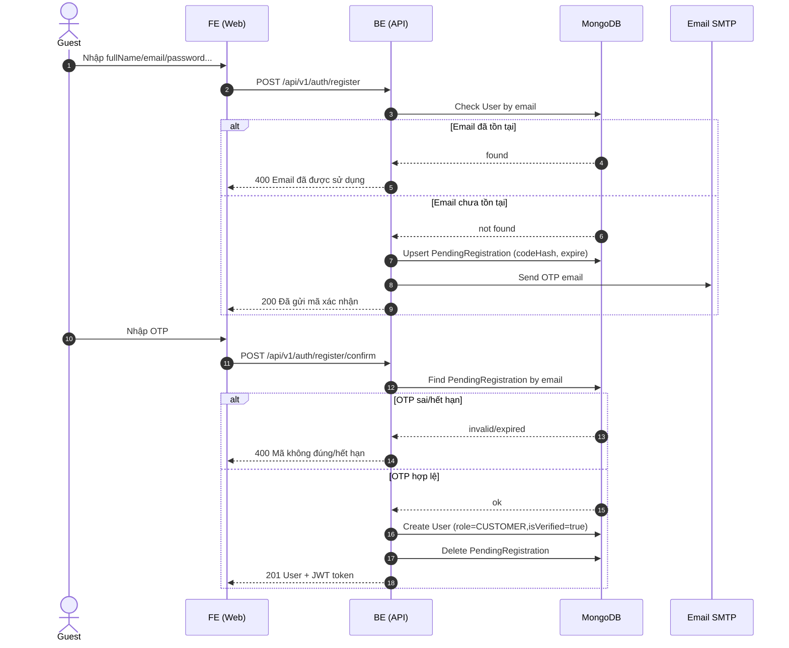

---

## 2) Login — `/api/v1/auth/login`

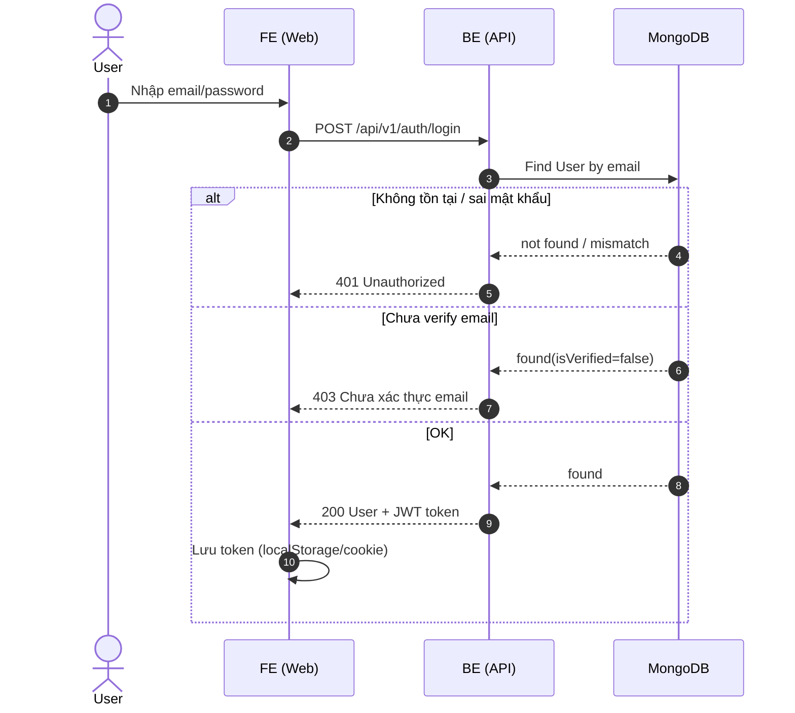

---

## 3) Browse + View Product Detail — `/api/v1/products`

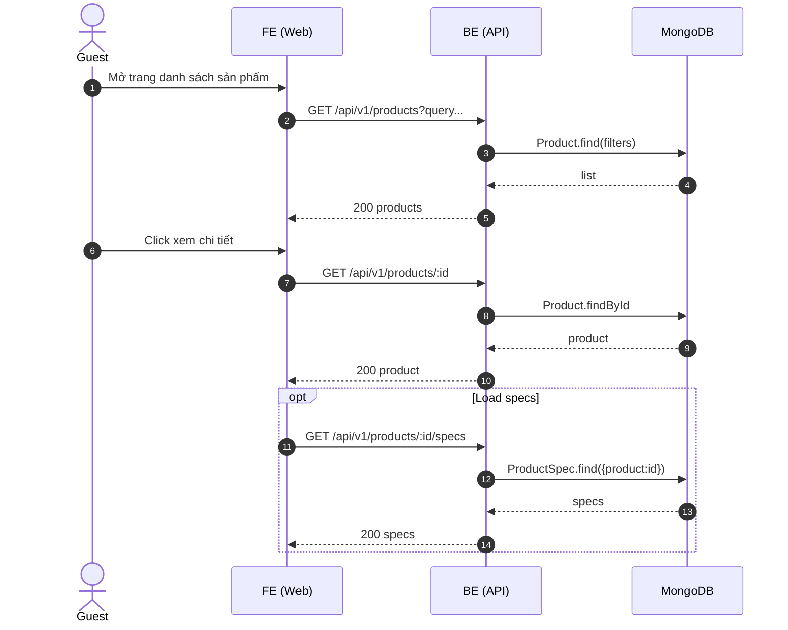

---

## 4) Manage Cart (Add/Update/Remove) — `/api/v1/cart/me/*`

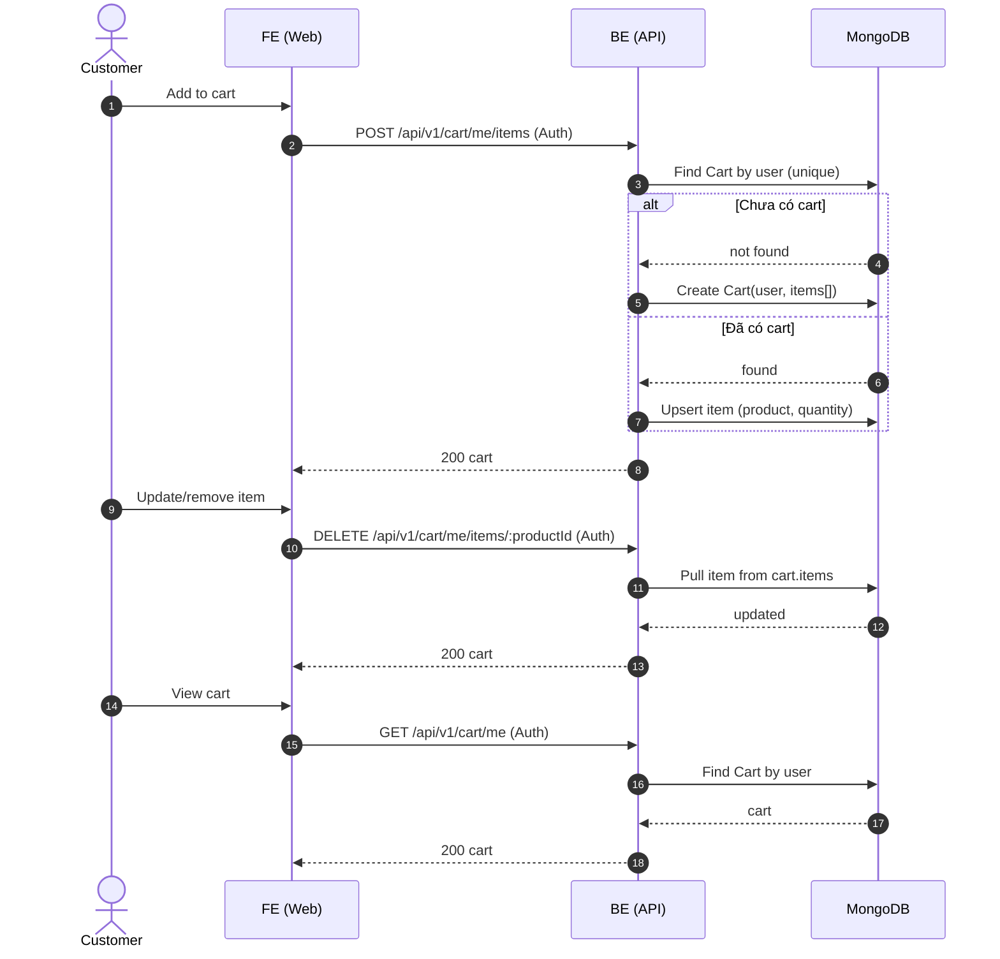

---

## 5) Checkout (COD) — Create Order — `POST /api/v1/orders`

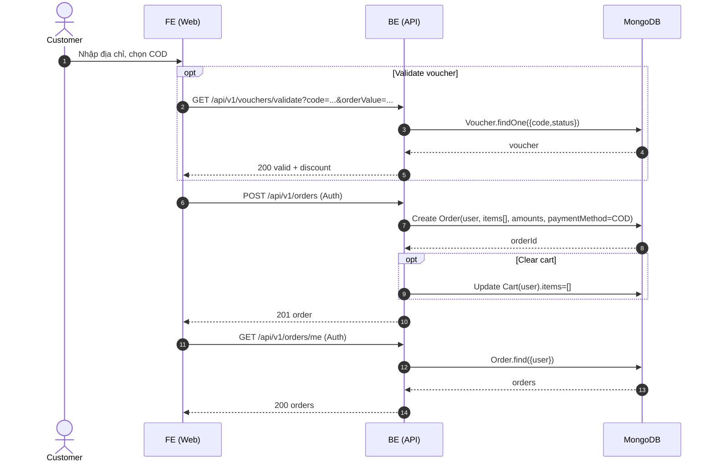

---

## 6) Checkout (PayOS/VNPay/MoMo) — tạo link thanh toán + callback/webhook

> BE có endpoints: `POST /api/v1/payments/payos|vnpay|momo/create/:orderId` và các URL return/webhook.

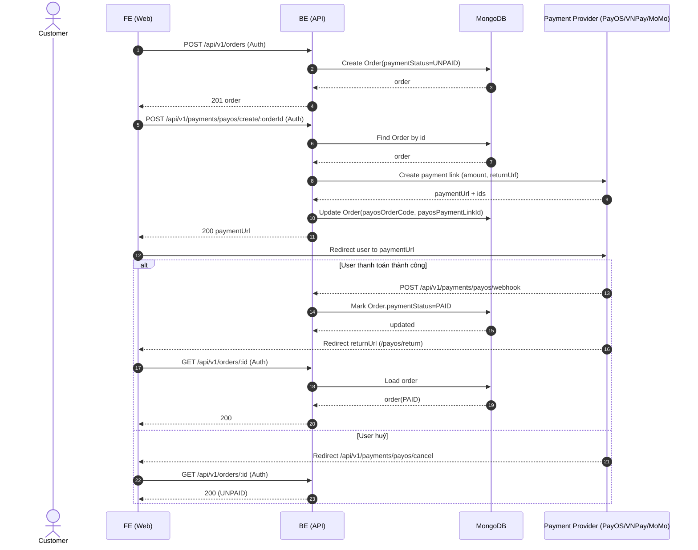

---

## 7) View/Track/Cancel Order — `/api/v1/orders/me` + update status (nếu cho phép)

> Lưu ý: trong code, cập nhật status là API admin/staff/delivery (`PUT /api/v1/orders/:id/status`). Customer thường chỉ “xem” và có thể yêu cầu huỷ (nếu bạn có logic); nếu hiện chưa có endpoint cancel riêng thì cancel nằm trong update status do staff/admin.

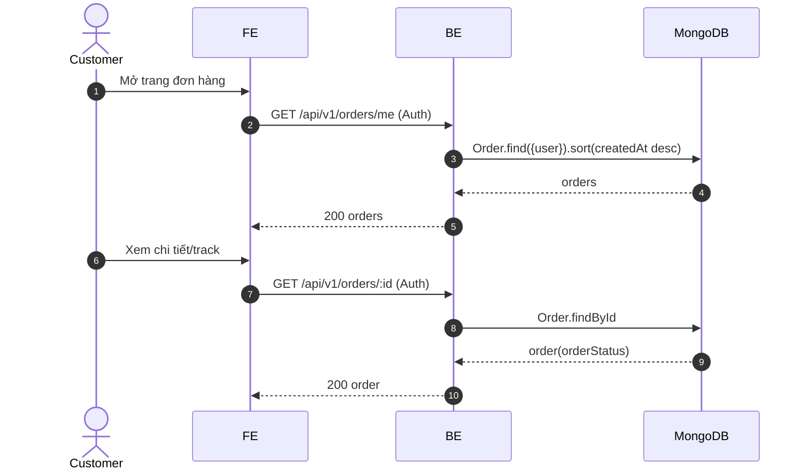

---

## 8) Rate & Review — `POST /api/v1/reviews`

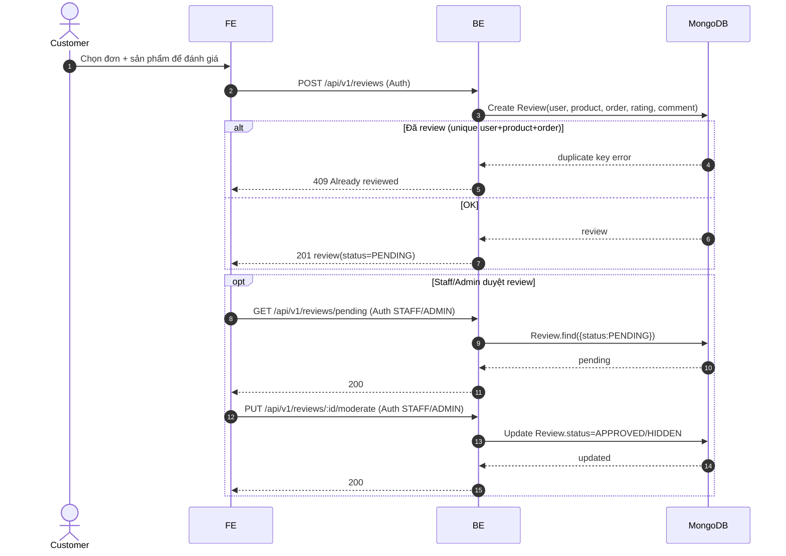

---

## 9) Chat Support — rooms + messages

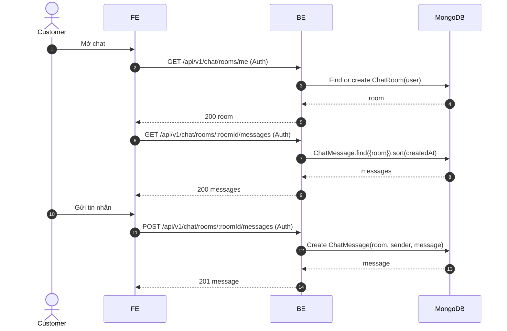

---

## 10) Staff/Admin xử lý đơn (Update Status) — `PUT /api/v1/orders/:id/status`

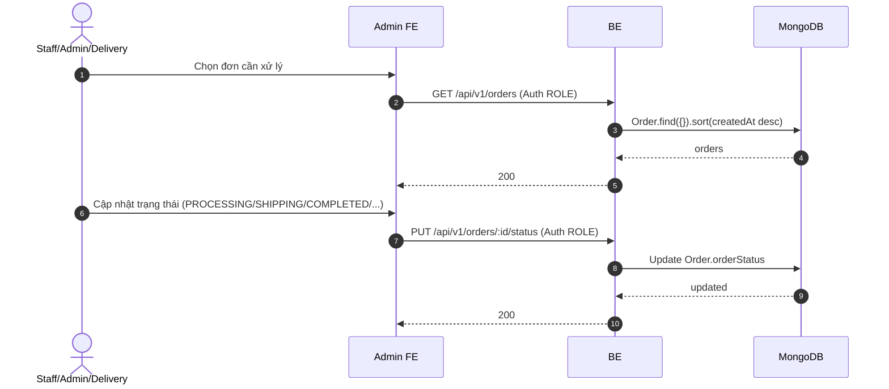

---

## 11) Warranty Claim — create & staff update

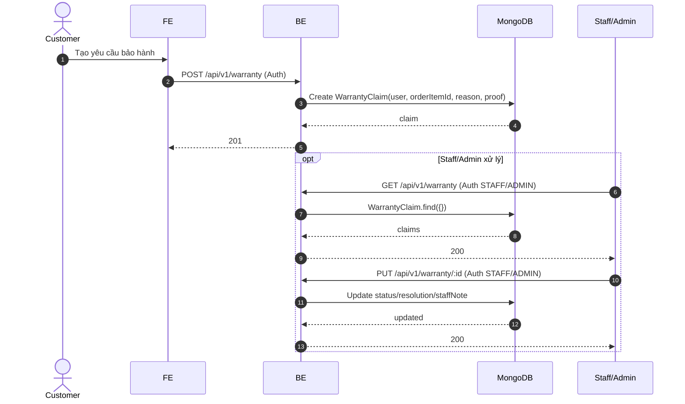

---

## 12) Import Receipt (Nhập hàng) — `POST /api/v1/import-receipts`

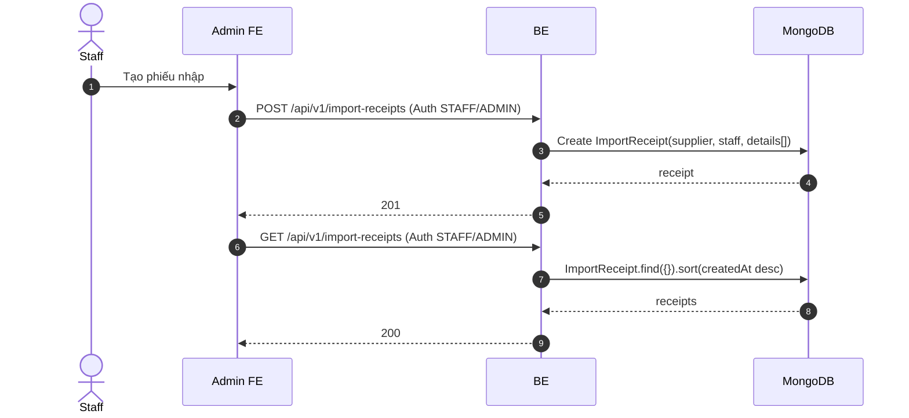
