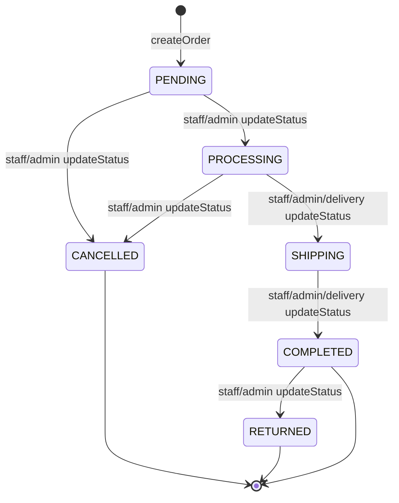
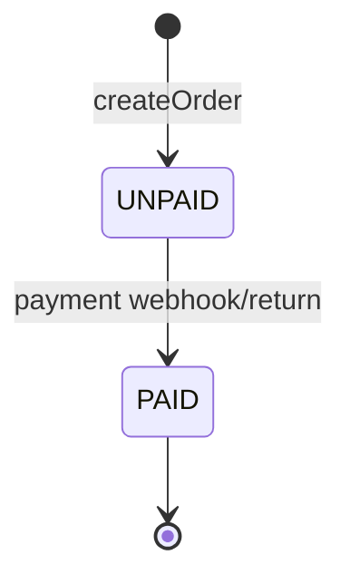
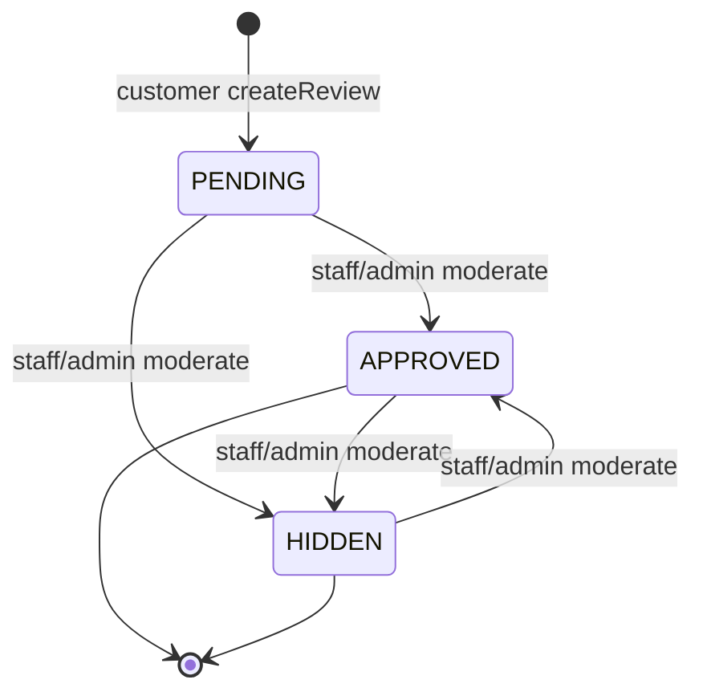
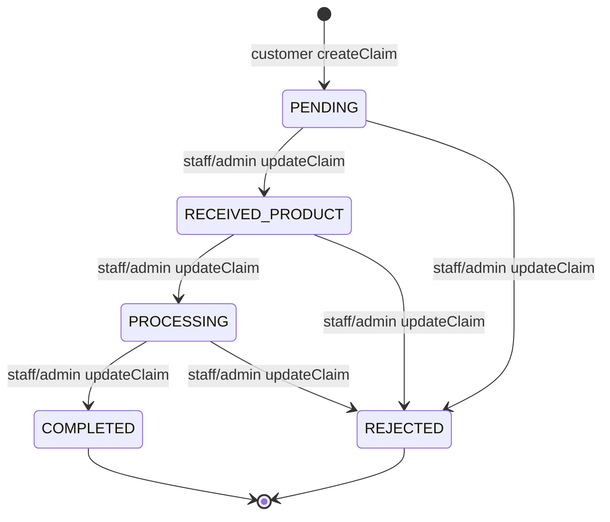
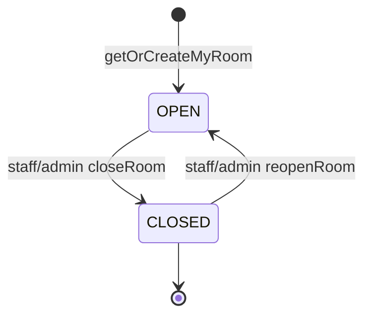
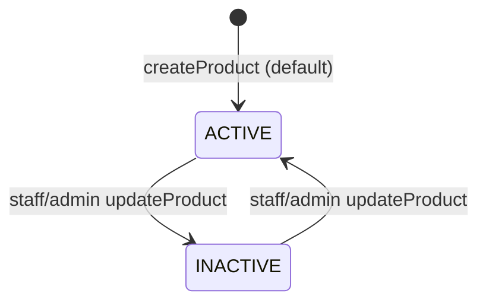
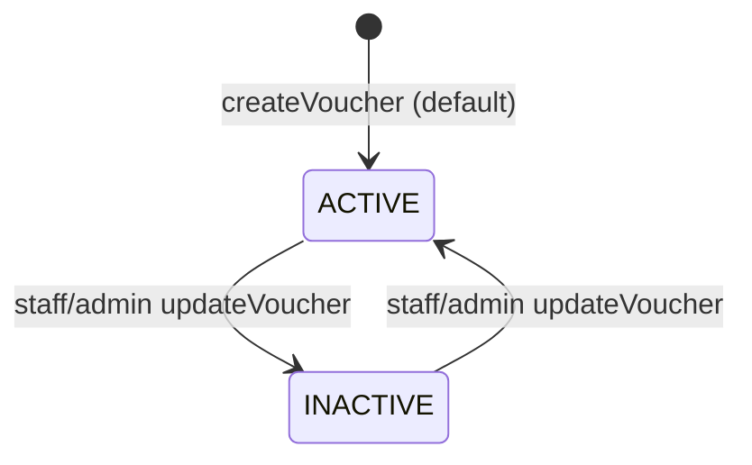

# State Machine Diagrams — TechGearVN (theo model enums hiện tại)

Các state machine dưới đây bám theo enum trong models:

- Order: `Order.orderStatus`, `Order.paymentStatus`
- Review: `Review.status`
- WarrantyClaim: `WarrantyClaim.status`
- ChatRoom: `ChatRoom.status`
- Product: `Product.status`
- Voucher: `Voucher.status`

---

## 1) Order — OrderStatus

Nguồn: `BE/server/models/Order.js`

States:

- `PENDING` → `PROCESSING` → `SHIPPING` → `COMPLETED`
- Nhánh kết thúc khác: `CANCELLED`, `RETURNED`

> Ghi chú: API cập nhật status hiện là `PUT /api/v1/orders/:id/status` cho role `ADMIN/STAFF/DELIVERY`.

---

## 2) Order — PaymentStatus

Nguồn: `BE/server/models/Order.js`

States:

- `UNPAID` → `PAID`

> Ghi chú: `paymentMethod` có thể là `COD|VNPAY|MOMO|PAYOS`; dự án hiện dùng callbacks/return/webhook để mark paid.

---

## 3) Review — ReviewStatus

Nguồn: `BE/server/models/Review.js`

States:

- `PENDING` → (`APPROVED` | `HIDDEN`)

---

## 4) WarrantyClaim — WarrantyStatus

Nguồn: `BE/server/models/WarrantyClaim.js`

States:

- `PENDING` → `RECEIVED_PRODUCT` → `PROCESSING` → `COMPLETED`
- Nhánh từ chối: `REJECTED`

---

## 5) ChatRoom — ChatRoomStatus

Nguồn: `BE/server/models/ChatRoom.js`

States:

- `OPEN` ↔ `CLOSED`

> Ghi chú: Trong routes có `PUT /chat/rooms/:roomId/status` cho `ADMIN/STAFF`.

---

## 6) Product — ProductStatus

Nguồn: `BE/server/models/Product.js`

States:

- `ACTIVE` ↔ `INACTIVE`

---

## 7) Voucher — VoucherStatus

Nguồn: `BE/server/models/Voucher.js`

States:

- `ACTIVE` ↔ `INACTIVE`

