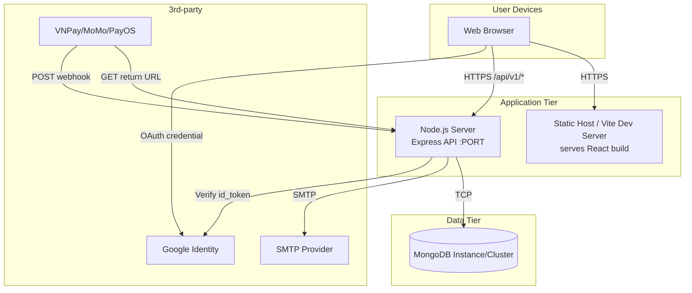

# System Architecture — TechGearVN (theo code hiện tại)

Tài liệu này mô tả kiến trúc tổng quan của hệ thống TechGearVN theo implementation hiện có trong repo:

- FE: React + Vite (thư mục `FE/`)
- BE: Node.js + Express API (entry: `BE/server.js`)
- DB: MongoDB thông qua Mongoose (config: `BE/server/config/db.js`)
- Tích hợp ngoài: Email SMTP (OTP/register), Payment Providers (VNPay/MoMo/PayOS)

> Mục tiêu: bạn có thể đưa phần này vào báo cáo “System Architecture” để giải thích hệ thống hoạt động thế nào, không phải thiết kế lý tưởng hoá.

---

## 1) Bối cảnh & ranh giới hệ thống

- Hệ thống phục vụ 2 nhóm UI:
  - **Web khách hàng** (browse sản phẩm, giỏ hàng, đặt hàng, thanh toán, chat, đánh giá…)
  - **Admin/Staff UI** (quản trị sản phẩm, đơn hàng, voucher, nhập hàng, bảo hành, nội dung…)
- BE cung cấp REST API dưới prefix: `/api/v1/*`.
- Trạng thái nghiệp vụ (OrderStatus/PaymentStatus/ReviewStatus/…) được lưu trong MongoDB.

---

## 2) Logical Architecture (Component View)

### 2.1 Phân lớp chính

- **Presentation layer (FE)**: React pages/components gọi API qua HTTP(S).
- **Application layer (BE)**: Express routes → controllers → services.
- **Data layer (DB)**: Mongoose models/collections.

### 2.2 Sơ đồ component (Mermaid)

```mermaid
flowchart LR
  %% Clients
  subgraph Clients
    CUST[Customer Browser]
    ADMIN[Admin/Staff Browser]
  end

  %% Frontend
  subgraph FE[Frontend (React + Vite)]
    UI[UI Pages/Components]
    APIClient[API Client (fetch/axios)]
    UI --> APIClient
  end

  %% Backend
  subgraph BE[Backend (Node.js + Express)]
    Router[Routes /api/v1/*]
    Ctrl[Controllers]
    Svc[Services]
    AuthMW[Auth Middleware\nJWT protect + authorize]

    Router --> AuthMW
    AuthMW --> Ctrl
    Ctrl --> Svc
  end

  %% Data
  subgraph DB[MongoDB]
    Mongoose[Mongoose Models\n(User, Product, Order, ...)]
  end

  %% Integrations
  subgraph External[External Services]
    SMTP[Email SMTP\n(OTP/Register, reset password)]
    PSP[Payment Providers\n(VNPay / MoMo / PayOS)]
    Google[Google Identity\n(Google login)]
  end

  %% Flows
  CUST --> FE
  ADMIN --> FE

  APIClient -->|HTTPS JSON| Router
  Svc -->|Mongoose| Mongoose
  Svc -->|Send email| SMTP
  Svc -->|Verify credential| Google

  %% Payment: create link + callback/webhook
  Ctrl -->|Create payment URL| PSP
  PSP -->|Return URL (GET)| Router
  PSP -->|Webhook (POST)| Router

  Mongoose --> DB
```

---

## 3) Deployment Architecture (Runtime View)

> Thực tế triển khai có thể khác (local/dev, VPS, cloud). Sơ đồ dưới đây mô tả tối thiểu các node runtime & luồng network.



---

## 4) Các luồng tích hợp quan trọng

### 4.1 Auth + OTP register (Email)

- FE gọi `POST /api/v1/auth/register`.
- BE tạo/cập nhật `PendingRegistration` + gửi OTP qua `utils/mailer.sendEmail`.
- FE xác nhận `POST /api/v1/auth/register/confirm` → BE tạo `User` và trả JWT.

### 4.2 Thanh toán online (PayOS/VNPay/MoMo)

- FE tạo order: `POST /api/v1/orders` (JWT).
- FE tạo link thanh toán: `POST /api/v1/payments/{payos|vnpay|momo}/create/:orderId` (JWT).
- Provider gọi về BE thông qua:
  - Return URL (GET): `/api/v1/payments/*/return`
  - Webhook (POST): `/api/v1/payments/payos/webhook`
- BE cập nhật `Order.paymentStatus` trong MongoDB.

> Lưu ý triển khai: các callback/webhook là public endpoint (không JWT) nên cần validate chữ ký/secret theo provider.

### 4.3 Chat support (REST)

- Chat hiện là REST (không WebSocket):
  - `GET /api/v1/chat/rooms/me`
  - `GET/POST /api/v1/chat/rooms/:roomId/messages`

---

## 5) Các điểm cấu hình (từ code)

- BE load env: `dotenv.config({ path: BE/server/.env })` trong `BE/server.js`.
- MongoDB: `process.env.MONGO_URI`.
- JWT: `process.env.JWT_SECRET`.
- FE URL: `process.env.FRONTEND_URL` (fallback `http://localhost:5174`).

---

## 6) Liên kết tài liệu UML liên quan

- Data model (Mongo/Mongoose): `BE/MONGO_DATA_MODEL.md`
- Use case: `BE/USE_CASE.md`
- Class diagram: `BE/CLASS_DIAGRAM.md`
- Sequence diagrams: `BE/SEQUENCE_DIAGRAMS.md`
- Activity diagrams: `BE/ACTIVITY_DIAGRAMS.md`
- State machines: `BE/STATE_MACHINE_DIAGRAMS.md`
