# Use Case Diagram (theo code BE hiện tại)

Tài liệu này sửa lại UC cho **khớp với các routes/controllers hiện có** trong `BE/server/routes/*`.

## 1) Những điểm sai/chưa chuẩn trong UC bạn vẽ

- `Make Payment` không nên là “use case gốc” để `Track Order`/`Cancel Order` _extend_. Theo nghiệp vụ và theo API, `Track/Cancel` thuộc luồng **quản lý đơn hàng** sau khi đã đặt.
- Quan hệ giữa `Add to Cart` ↔ `Place Order` nên là: **đặt hàng phụ thuộc giỏ hàng** (include “Manage Cart/Checkout”), không phải chiều ngược lại mơ hồ.
- Actor `Delivery Personnel` trong code **chưa có module Delivery riêng**; role `DELIVERY` chỉ đang được phép xem & cập nhật trạng thái Order (xem `orderRoutes`).
- UC đang thiếu nhiều chức năng đã có thật: Chat, Voucher, Saved PC Build, Import Receipt/Supplier, Warranty, Article/Banner, Settings, Moderate reviews, Analytics.

## 2) UC đề xuất (khớp code)

### Actors

- **Guest**: chưa đăng nhập
- **Customer**: user role `CUSTOMER`
- **Staff**: user role `STAFF`
- **Admin**: user role `ADMIN`
- **Delivery**: user role `DELIVERY`

> Ghi chú: Trong code, `ADMIN/STAFF/DELIVERY` đều là biến thể của `User.role`.

## 3) Diagram (Mermaid)

```mermaid
flowchart LR
  %% Actors
  Guest[Guest]
  Customer[Customer]
  Staff[Staff]
  Admin[Admin]
  Delivery[Delivery]

  %% System boundary
  subgraph SYS[TechGear VietNam]
    %% Public
    UC_Browse((Browse Products))
    UC_Search((Search Products))
    UC_ViewDetail((View Product Details))
    UC_ViewArticles((View Articles))
    UC_ViewBanners((View Banners))

    %% Auth & profile
    UC_Register((Register Account))
    UC_Login((Login))
    UC_ManageProfile((Manage Profile))

    %% Cart & order
    UC_ManageCart((Manage Cart))
    UC_AddCart((Add Item to Cart))
    UC_UpdateCart((Update/Remove Cart Item))

    UC_PlaceOrder((Place Order / Checkout))
    UC_ApplyVoucher((Apply Voucher))
    UC_MakePayment((Pay Online))

    UC_ViewMyOrders((View My Orders))
    UC_TrackOrder((Track Order))
    UC_CancelOrder((Cancel Order))

    UC_RateReview((Rate & Review))

    %% Customer support
    UC_ChatSupport((Chat with Support))

    %% Admin/Staff ops
    UC_ManageProducts((Manage Products & Specs))
    UC_ManageCategories((Manage Categories))
    UC_ManageBrands((Manage Brands))
    UC_ManageOrders((Process Orders / Update Status))
    UC_ManageVouchers((Manage Vouchers))
    UC_ModerateReviews((Moderate Reviews))

    UC_ManageSuppliers((Manage Suppliers))
    UC_ManageImportReceipts((Manage Import Receipts))
    UC_ManageWarranty((Manage Warranty Claims))

    UC_ManageArticles((Manage Articles))
    UC_ManageBanners((Manage Banners))

    UC_ManageSavedBuild((Manage Saved PC Builds))

    %% Admin only
    UC_ManageUsers((Manage Users))
    UC_Analytics((View Analytics Overview))
    UC_Settings((Update Settings))

    %% Delivery
    UC_DeliveryOrders((View Orders))
    UC_UpdateOrderStatus((Update Order Status))

  end

  %% Guest connections
  Guest --> UC_Browse
  Guest --> UC_Search
  Guest --> UC_ViewDetail
  Guest --> UC_ViewArticles
  Guest --> UC_ViewBanners
  Guest --> UC_Register
  Guest --> UC_Login

  %% Customer connections
  Customer --> UC_Browse
  Customer --> UC_Search
  Customer --> UC_ViewDetail
  Customer --> UC_ViewArticles
  Customer --> UC_ViewBanners
  Customer --> UC_ManageProfile
  Customer --> UC_ManageCart
  Customer --> UC_PlaceOrder
  Customer --> UC_ViewMyOrders
  Customer --> UC_TrackOrder
  Customer --> UC_CancelOrder
  Customer --> UC_RateReview
  Customer --> UC_ChatSupport
  Customer --> UC_ManageSavedBuild

  %% Staff connections
  Staff --> UC_ManageProducts
  Staff --> UC_ManageCategories
  Staff --> UC_ManageBrands
  Staff --> UC_ManageOrders
  Staff --> UC_ManageVouchers
  Staff --> UC_ModerateReviews
  Staff --> UC_ManageSuppliers
  Staff --> UC_ManageImportReceipts
  Staff --> UC_ManageWarranty
  Staff --> UC_ManageArticles
  Staff --> UC_ManageBanners
  Staff --> UC_ChatSupport

  %% Admin connections (Admin có toàn quyền staff + riêng admin)
  Admin --> UC_ManageProducts
  Admin --> UC_ManageCategories
  Admin --> UC_ManageBrands
  Admin --> UC_ManageOrders
  Admin --> UC_ManageVouchers
  Admin --> UC_ModerateReviews
  Admin --> UC_ManageSuppliers
  Admin --> UC_ManageImportReceipts
  Admin --> UC_ManageWarranty
  Admin --> UC_ManageArticles
  Admin --> UC_ManageBanners
  Admin --> UC_ChatSupport

  Admin --> UC_ManageUsers
  Admin --> UC_Analytics
  Admin --> UC_Settings

  %% Delivery role in code
  Delivery --> UC_DeliveryOrders
  Delivery --> UC_UpdateOrderStatus

  %% Includes / extends semantics (annotated)
  UC_ManageCart --> UC_AddCart
  UC_ManageCart --> UC_UpdateCart

  UC_PlaceOrder -.-> UC_ManageCart
  UC_PlaceOrder -.-> UC_ApplyVoucher
  UC_PlaceOrder -.-> UC_MakePayment

  UC_TrackOrder -.-> UC_ViewMyOrders
  UC_CancelOrder -.-> UC_ViewMyOrders
  UC_RateReview -.-> UC_ViewMyOrders

  UC_UpdateOrderStatus -.-> UC_DeliveryOrders
```

## 4) Mapping nhanh tới routes (để bạn dễ kiểm chứng)

- Public products: `GET /api/v1/products`, `GET /api/v1/products/:id`
- Cart: `GET/PUT /api/v1/cart/me`, `POST /api/v1/cart/me/items`, `DELETE ...`
- Order: `POST /api/v1/orders`, `GET /api/v1/orders/me`, `GET /api/v1/orders/:id`
- Payment (online): `/api/v1/payments/*/create/:orderId` + return/webhook
- Review: `POST /api/v1/reviews`, `GET /api/v1/reviews/product/:productIdOrSlug`, moderate pending
- Voucher: `GET /api/v1/vouchers/validate` + CRUD (admin/staff)
- Chat: `/api/v1/chat/rooms*` + messages
- Warranty: `/api/v1/warranty/*`
- Supplier/ImportReceipt: `/api/v1/suppliers/*`, `/api/v1/import-receipts/*`
- Article/Banner/Setting/Admin analytics: `/api/v1/articles/*`, `/api/v1/banners/*`, `/api/v1/settings`, `/api/v1/admin/analytics/overview`

## 5) Gợi ý chỉnh lại hình UC bạn đang vẽ (ngắn gọn)

- Xoá hoặc đổi `Manage Delivery` → `View Orders` + `Update Order Status` (vì code chưa có module delivery riêng).
- Đổi `Make Payment` thành `Pay Online` và để nó là bước trong `Place Order/Checkout`.
- Cho `Track Order`, `Cancel Order`, `Rate & Review` phụ thuộc `View My Orders` (vì API đang theo `/orders/me`).
- Thêm UC: `Chat with Support`, `Manage Vouchers`, `Manage Import Receipts/Suppliers`, `Warranty Claims`, `Saved PC Builds`, `Articles/Banners`, `Settings`, `Moderate Reviews`, `Analytics`.
